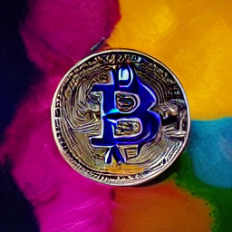

<figure style="text-align: center;">
  
  <figcaption>Bitcoin Art</figcaption>
</figure>

# Why the establishment hates Bitcoin

Bitcoin is a new technology that could revolutionize the world economy and slowly gain traction worldwide. However, it is opposed by many powerful institutions and individuals, and it's not hard to see why. Bitcoin is a direct threat to the status quo. It bypasses the need for banks and other financial institutions, which is why Warren Buffet has called Bitcoin "rat poison squared."

In this blog post, we will further explore the reasons behind the opposition to Bitcoin and try to understand how Blockchain, the technology behind Bitcoin and other cryptocurrencies, is far more unique than anything that has gone before.

## To understand the opposition to Bitcoin, we first have to understand trust in current monetary systems.

I remember the first time I heard about bitcoin, and my initial reaction was that it was a load of bull. I considered this just another way to amass a foolish digital coin. My first thoughts were the same as Warren Buffett's, predicting that bitcoin would come to an unpleasant conclusion.

But then it dawned on me! Never before had trust been represented in code. Don't get me wrong. I am not talking about security that had been done. But, no, this was different because it incorporated faith, not just protection.

You see, before the Blockchain came along, if you shared a file or an MP3, you could never ensure that someone else wouldn't copy it. Furthermore, if they copied it, you'd have no way of knowing whether the original file was genuine.

That was when I saw the link between Bitcoin and Money. The Blockchain could guarantee that no one coin could be forged or copied. It was a way of creating trust.
Bitcoin is a decentralized, digital currency that isn't backed by any government. Instead, it is supported by math and code. Blockchain is one of the first computer-code systems to establish trust among users without needing a central authority. Think of it this way Blockchain equals trust.

**Blockchain = trust**

Money, after all, is an idea. It only has value because we trust it does. The US dollar, for example, is backed by the "full faith and credit" of the US government. In other words, we trust that the US government will accept dollars as payment for taxes and that it will use its power to ensure that other people will take dollars too.

## But what happens when that trust starts to disappear?

So, when people lose confidence in the government's and leaders' capacity to keep the value of its currency stable. Then, Bitcoin can become an alternative to the current monetary system and a direct threat to the establishment and some people's wealth.
That is now what I think is happing. People are slowly losing faith in our current monetary system and central banks' ability to look after it. So they are searching for an alternative, and Bitcoin is one of the most popular options.

This lack of trust is driving the adoption of Bitcoin and Blockchain. And it is why I believe that Blockchain is revolutionary. But, unfortunately, it's also why so many people in positions of authority despise it. It immediately reclaims power from them as a focal point of trust and hands it back to the people.

Satoshi Nakamoto, the creator of Bitcoin, said that he wanted to create "an electronic payment system based on cryptographic proof instead of trust." In other words, a system that would not require faith or trust in a central authority.

