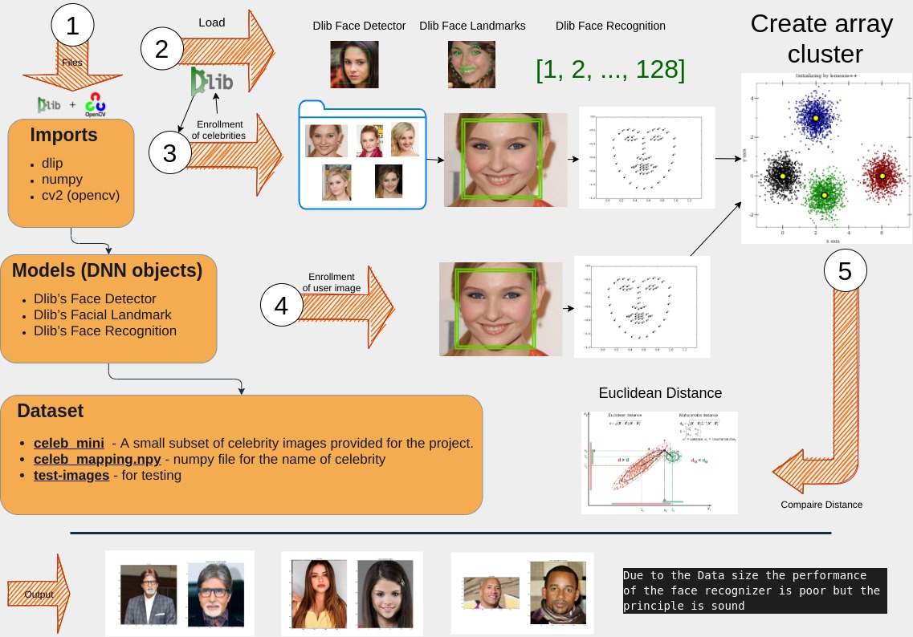

In this project, I demonstrate how to use OpenCV and Dlib to create a celebrity look-alike application using c++ instead of python.

The application works by converting a face into a high-dimensional vector of points and then learns its feature space. Or put simply, it clusters the facial vector points together and then compares the distance between two clusters to determine if they are similar to each other.

When I recode a project from Python to C++, I do it to understand the program itself better. As a result, I often see some advantages for the application in production, but unfortunately, I didn't see any for this project.

Python would have worked fine in creating the feature space vectors, which could easily be stored in a file and recalled later. Again, either with python or C++, depending on the need. 

Below is an overview video and diagram of my thought process with all code available in my GitHub repository. 

## <a href="https://github.com/matthewaltenburg/DoppelGanger-Find-your-Celebrity-Look-Alike.git" target="_blank">Github code repository</a>

<p align="center">
<iframe
    style="align:center"
    width="640"
    height="480"
    src="https://www.youtube.com/embed/0zbwZKR43lM"
    frameborder="0"
    allowfullscreen
>
</iframe>
</p>

## Overview diagram of the project


<figure style="text-align: center;">
  
  <figcaption>Overview</figcaption>
</figure>

## c++ code

```cpp
#include <dirent.h> // for opendir
#include <dlib/clustering.h>
#include <dlib/dnn.h>
#include <dlib/gui_widgets.h>
#include <dlib/image_io.h>
#include <dlib/image_processing.h>
#include <dlib/image_processing/frontal_face_detector.h>
#include <dlib/opencv.h>
#include <dlib/string.h>
#include <filesystem> // for ittering through the filesystem
#include <fstream>
#include <iostream> // stdin and stdout
#include <map>      // dictionaies
#include <opencv2/imgproc.hpp>
#include <opencv2/opencv.hpp>
#include <sstream>
#include <string>

using namespace cv;
using namespace std;
using namespace dlib;

// This code defines a ResNet network.  It's basically copied
// and pasted from the dnn_imagenet_ex.cpp example.
template <template <int, template <typename> class, int, typename> class block,
          int N, template <typename> class BN, typename SUBNET>
using residual = add_prev1<block<N, BN, 1, tag1<SUBNET>>>;
template <template <int, template <typename> class, int, typename> class block,
          int N, template <typename> class BN, typename SUBNET>
using residual_down =
    add_prev2<avg_pool<2, 2, 2, 2, skip1<tag2<block<N, BN, 2, tag1<SUBNET>>>>>>;
template <int N, template <typename> class BN, int stride, typename SUBNET>
using block =
    BN<con<N, 3, 3, 1, 1, relu<BN<con<N, 3, 3, stride, stride, SUBNET>>>>>;
template <int N, typename SUBNET>
using ares = relu<residual<block, N, affine, SUBNET>>;
template <int N, typename SUBNET>
using ares_down = relu<residual_down<block, N, affine, SUBNET>>;
template <typename SUBNET> using alevel0 = ares_down<256, SUBNET>;
template <typename SUBNET>
using alevel1 = ares<256, ares<256, ares_down<256, SUBNET>>>;
template <typename SUBNET>
using alevel2 = ares<128, ares<128, ares_down<128, SUBNET>>>;
template <typename SUBNET>
using alevel3 = ares<64, ares<64, ares<64, ares_down<64, SUBNET>>>>;
template <typename SUBNET> using alevel4 = ares<32, ares<32, ares<32, SUBNET>>>;
using anet_type = loss_metric<fc_no_bias<
    128,
    avg_pool_everything<alevel0<alevel1<alevel2<alevel3<alevel4<max_pool<
        3, 3, 2, 2,
        relu<affine<con<32, 7, 7, 2, 2, input_rgb_image_sized<150>>>>>>>>>>>>>;

// function for inroling the images
void inrole_data(frontal_face_detector faceDetector,
                 shape_predictor shapePredictor, anet_type faceRecognizer);

void lookalike(frontal_face_detector faceDetector,
               shape_predictor shapePredictor, anet_type faceRecognizer);

// Main function
int main() {

  // Set up the faceDetector
  frontal_face_detector faceDetector = get_frontal_face_detector();
  // Set up the shapePredictor
  string face68 = "/home/matthew/DoppelGanger-Find-your-Celebrity-Look-Alike/"
                  "shape_predictor_68_face_landmarks.dat";
  shape_predictor shapePredictor;
  deserialize(face68) >> shapePredictor;
  // Set up the faceRecognizer
  anet_type faceRecognizer;
  deserialize("/home/matthew/DoppelGanger-Find-your-Celebrity-Look-Alike/"
              "dlib_face_recognition_resnet_model_v1.dat") >>
      faceRecognizer;

  // testPoint
  cout << "1 Successfully loading faceDetector, shapePredictor and "
          "faceRecognizer!"
       << endl;

  ifstream f("/home/matthew/DoppelGanger-Find-your-Celebrity-Look-Alike/"
             "descriptors.csv");

  if (f.good() == false) {
    cout << "Creating faceDetector CSV file enrollment" << endl;
    inrole_data(faceDetector, shapePredictor, faceRecognizer);
  }
  cout << "Running new image enrollment" << endl;
  lookalike(faceDetector, shapePredictor, faceRecognizer);

  return 0;
};

void inrole_data(frontal_face_detector faceDetector,
                 shape_predictor shapePredictor, anet_type faceRecognizer)
//     """This function creates a face descriptors of (1x128) for each face
//     in the images folder and names files and stores them as face descriptors
//     and labels.
{

  string celebFolder =
      "/home/matthew/DoppelGanger-Find-your-Celebrity-Look-Alike/celeb_minicpp";
  int x = 0;
  // for writing to disk
  const string descriptorsPath =
      "/home/matthew/DoppelGanger-Find-your-Celebrity-Look-Alike/"
      "descriptors.csv";
  ofstream output;
  output.open(descriptorsPath);

  for (auto const &images : std::filesystem::directory_iterator{celebFolder})
    for (auto const &image : std::filesystem::directory_iterator{images}) {
      cout << image.path().stem() << endl;

      // load the image using the Dlib library
      matrix<rgb_pixel> imDlib;
      load_image(imDlib, image.path());

      // run face detection to detect faces in image
      std::vector<dlib::rectangle> faceRects = faceDetector(imDlib);

      // loop through the faces in in image and find shape and descriptors
      for (int j = 0; j < faceRects.size(); j++) {

        // Find facial landmarks for each detected face
        full_object_detection shape = shapePredictor(imDlib, faceRects[j]);

        // Compute face descriptor using neural network defined in Dlib.
        matrix<rgb_pixel> face_chip;
        extract_image_chip(imDlib, get_face_chip_details(shape, 150, 0.25),
                           face_chip);
        matrix<float, 0, 1> faceDescriptor = faceRecognizer(face_chip);

        output << image.path().stem();
        for (auto const &face : faceDescriptor) {
          output << "," << face;
        };
        output << endl;
      }

      x++;
      cout << x << endl;
    };

  output.close();
}

void lookalike(frontal_face_detector faceDetector,
               shape_predictor shapePredictor, anet_type faceRecognizer) {
  // Inrole any new face detections
  string path;
  cout << "please enter new image path" << endl;
  getline(cin, path);

  ifstream ff(path);

  while (ff.good() == false) {
    cout << "image not found please enter new image path" << endl;
    getline(cin, path);
    ifstream ff(path);
    if (ff.good()) {
      break;
    }
  }
  cout << "image found" << endl;

  matrix<rgb_pixel> imDlib;
  load_image(imDlib, path);

  std::vector<dlib::rectangle> faceRects = faceDetector(imDlib);
  matrix<float, 0, 1> faceDescriptor;
  // Compute face descriptor using neural network defined in Dlib.
  for (int j = 0; j < faceRects.size(); j++) {

    // Find facial landmarks for each detected face
    full_object_detection shape = shapePredictor(imDlib, faceRects[j]);

    // Compute face descriptor using neural network defined in Dlib.
    matrix<rgb_pixel> face_chip;
    extract_image_chip(imDlib, get_face_chip_details(shape, 150, 0.25),
                       face_chip);
    faceDescriptor = faceRecognizer(face_chip);
  };

  // import csv to map object with the names of the celeb's and the 128 vectors
  std::map<std::string, dlib::matrix<float, 0, 1>> cele_dict;
  dlib::array<float> float_array = dlib::array<float>();

  ifstream csvFile;
  csvFile.open("/home/matthew/DoppelGanger-Find-your-Celebrity-Look-Alike/"
               "descriptors.csv");
  string name;

  while (csvFile.good()) {
    getline(csvFile, name);
    stringstream ss(name);
    std::string substr;
    getline(ss, substr, ',');
    string fileName = substr;
    float_array.clear();

    while (ss.good()) {
      getline(ss, substr, ',');
      float_array.push_back(stof(substr));
    }
    auto float_mat = mat(float_array);
    auto float_matrix = matrix<float, 0, 1>(float_mat);

    cele_dict[fileName] = float_matrix;
  }

  double minDistance = 1;
  string label;

  // compairs the arrays
  for (auto i : cele_dict) {
    if (i.second.size() > 0) {
      double distance = dlib::length(faceDescriptor - i.second);

      if (distance < minDistance) {
        minDistance = distance;
        label = i.first;
      };
    };
  }
  csvFile.close();

  cout << "Picture looks like " << label << endl;
};
```