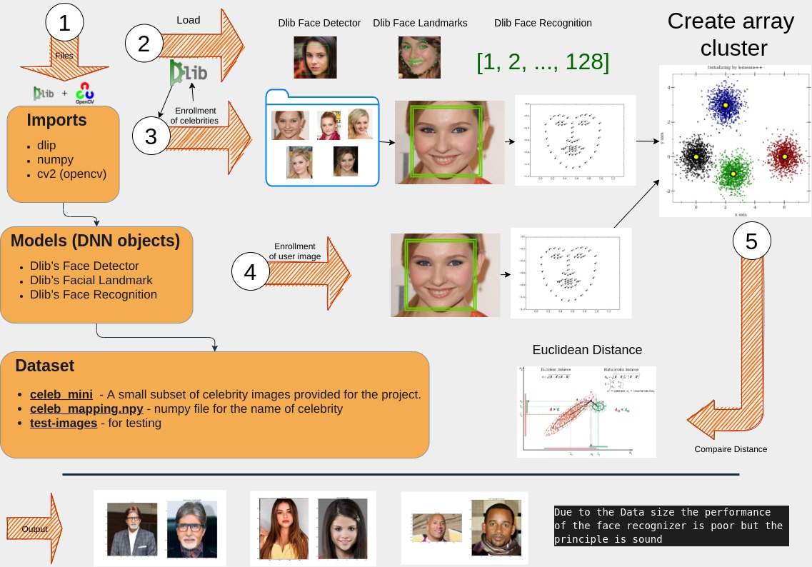

In this project, I demonstrate how to use OpenCV and Dlib to create a celebrity look-alike application.

The application works by converting a face into a high-dimensional vector of points and then learns its feature space. Or put simply, it clusters the facial vector points together and then compares the distance between two clusters to determine if they are similar to each other.

In order to keep the project simple, a smaller dataset was created in the celeb_mini folder and a NumPy array celeb_mapping.npy was used to link the image folders to names of the celebrities. 

Below is an overview video and diagram of my thought process with all code available in my GitHub repository. 

## <a href="https://github.com/matthewaltenburg/virtual_makeup_opencv.git" target="_blank">Github code repository</a>

<p align="center">
<iframe
    style="align:center"
    width="640"
    height="480"
    src="https://www.youtube.com/embed/uIhbzM1sGLo"
    frameborder="0"
    allowfullscreen
>
</iframe>
</p>

## Overview diagram of the project


<figure style="text-align: center;">
  
  <figcaption>Overview</figcaption>
</figure>

## Python code

```python
import os
import glob
import dlib
import cv2
import numpy as np
import matplotlib.pyplot as plt

# Set up the the faceDetector, shapePredictor and faceRecognizer to
# optimize speed as they are nedded by both functions.
faceDetector = dlib.get_frontal_face_detector()
shapePredictor = dlib.shape_predictor("shape_predictor_68_face_landmarks.dat")
faceRecognizer = dlib.face_recognition_model_v1(
    "dlib_face_recognition_resnet_model_v1.dat"
)


def inrole_data(faceDetector, shapePredictor, faceRecognizer):
    """This function creates a face descriptors of (1x128) for each face
    in the images and stores them in in a NumPy array. It also creates a dictionary
    to store the the index of array to names of the celebrity also in NumPy array.

    Args:
        faceDetector Dlib: used to detect faces in an image
        shapePredictor Dlib: identifies the locations of import facial landmarks
        faceRecognizer Dlib:  maps human faces into 128D vectors
    """

    # create a dictionary to uses as a index for each face descriptors to celebrity name.
    index = {}
    i = 0
    # create a NumPy array to store face descriptors
    faceDescriptors = None

    # loop though the images in folders
    for images in os.listdir("celeb_mini"):
        imagefiles = os.listdir(os.path.join("celeb_mini", images))
        for image in imagefiles:
            imagePath = os.path.join("celeb_mini", images, image)

            #  read each image and convert to a format form Dlib
            img = cv2.imread(imagePath)
            imDli = cv2.cvtColor(img, cv2.COLOR_BGR2RGB)

            # look for faces in image
            faces = faceDetector(imDli)

            # Create descriptor and index for each image
            for face in faces:

                # Find facial landmarks for each detected face
                shape = shapePredictor(imDli, face)

                # Compute face descriptor using neural network defined in Dlib.
                faceDescriptor = faceRecognizer.compute_face_descriptor(img, shape)

                # Convert face descriptor from Dlib's format to list, then a NumPy array
                faceDescriptorList = [x for x in faceDescriptor]
                faceDescriptorNdarray = np.asarray(faceDescriptorList, dtype=np.float64)
                faceDescriptorNdarray = faceDescriptorNdarray[np.newaxis, :]

                # add face descriptors to the faceDescriptor Numpy array.
                if faceDescriptors is None:
                    faceDescriptors = faceDescriptorNdarray
                else:
                    faceDescriptors = np.concatenate(
                        (faceDescriptors, faceDescriptorNdarray), axis=0
                    )

                # map celebrity name corresponding to face descriptors and stored in NumPy Array
                index[i] = np.load("celeb_mapping.npy", allow_pickle=True).item()[
                    images
                ]
                i += 1
    # save
    np.save("index.npy", index)
    np.save("faceDescriptors.npy", faceDescriptors)


def lookalike(faceDetector, shapePredictor, faceRecognizer):
    """This function loads images from the images folder and compares
    them to prebuilt face descriptors to find the best match
    for a celebrity look alike.

    Args:
        faceDetector Dlib: used to detect faces in an image
        shapePredictor Dlib: identifies the locations of import facial landmarks
        faceRecognizer Dlib:  maps human faces into 128D vectors
    """
    # load face descriptors and the names index
    faceDescriptors = np.load("faceDescriptors.npy")
    index = np.load("index.npy", allow_pickle="TRUE").item()

    # read image
    testImages = glob.glob("images/*.jpg")

    # loop though the images folder
    for image in testImages:
        # read the image and convert to Dlib format
        im = cv2.imread(image)
        imDli = cv2.cvtColor(im, cv2.COLOR_BGR2RGB)

        # detect faces
        faces = faceDetector(imDli)

        # create descriptor and index for each image
        for face in faces:
            shape = shapePredictor(imDli, face)

            faceDescriptor = faceRecognizer.compute_face_descriptor(im, shape)

            faceDescriptorList = [x for x in faceDescriptor]
            faceDescriptorNdarray = np.asarray(faceDescriptorList, dtype=np.float64)
            faceDescriptorNdarray = faceDescriptorNdarray[np.newaxis, :]

            # calculate the distances of the new face wiht face descriptors of celebrities
            distances = np.linalg.norm(faceDescriptors - faceDescriptorNdarray, axis=1)
            argmin = np.argmin(distances)
            minDistance = distances[argmin]

            # find an acceptable lookalike
            if minDistance <= 0.8:
                label = index[argmin]
            else:
                label = "unknown"

            celeb_name = label

            # load celebrity images from celeb_mini folder
            for images in os.listdir("celeb_mini"):
                imagefiles = os.listdir(os.path.join("celeb_mini", images))

                if (
                    np.load("celeb_mapping.npy", allow_pickle=True).item()[images]
                    == celeb_name
                ):
                    for image in imagefiles:
                        img_cele = cv2.imread(os.path.join("celeb_mini", images, image))
                        img_cele = cv2.cvtColor(img_cele, cv2.COLOR_BGR2RGB)
                        break

        # show images one at a time
        plt.subplot(121)
        plt.imshow(imDli)
        plt.title("test img")

        plt.subplot(122)
        plt.imshow(img_cele)
        plt.title("Celeb Look-Alike={}".format(celeb_name))
        plt.show()


def main():

    # to save time and not recreate the descriptors skip if the folder and index already exist
    if not os.path.exists("index.npy") or not os.path.exists("faceDescriptors.npy"):
        print("building face descriptors")
        inrole_data(faceDetector, shapePredictor, faceRecognizer)

    # show posabale celebrity lookalikes
    lookalike(faceDetector, shapePredictor, faceRecognizer)


if __name__ == "__main__":
    main()
```