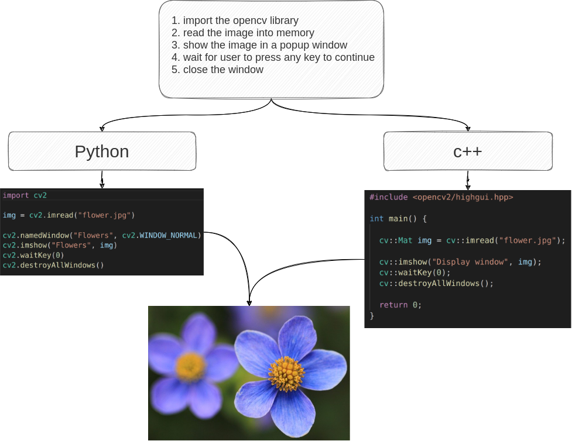

Here is an example of opening an image with OpenCV in both Python and C++.

I purposely kept it simple so as not to confuse anyone and make it easy to cut and paste code for getting started. 


<p align="center">
<iframe
    style="align:center"
    width="640"
    height="480"
    src="https://www.youtube.com/embed/_agcLreGUn0"
    frameborder="0"
    allowfullscreen
>
</iframe>
</p>

## Overview diagram of the project


<figure style="text-align: center;">
  
  <figcaption>Overview</figcaption>
</figure>

## Python code

```python
import cv2

img = cv2.imread("flower.jpg")

cv2.imshow("Flowers", img)
cv2.waitKey(0)
cv2.destroyAllWindows()
```

## C++ code

```cpp
#include <opencv2/highgui.hpp>

int main() {
  cv::Mat img = cv::imread("flower.jpg");

  cv::imshow("Display window", img);
  cv::waitKey(0);
  cv::destroyAllWindows();

  return 0;
}
```