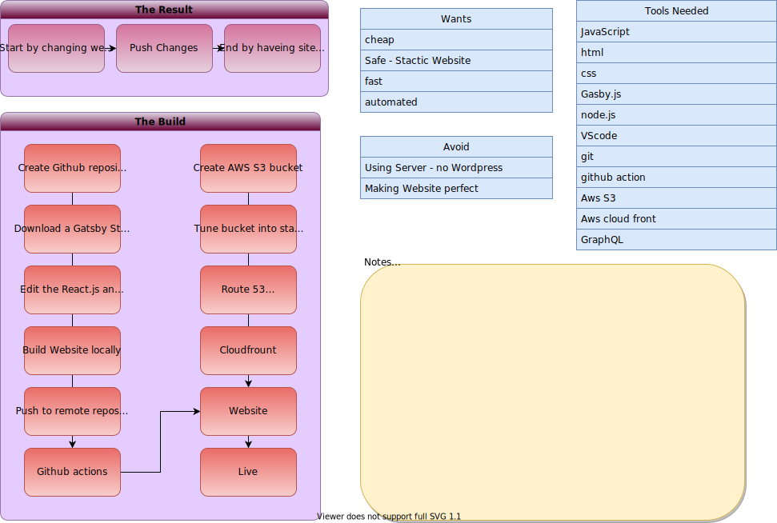

 
I thought it'd be fun to write a blog about how I created this website. It took about a week, which probably would have been faster, but I had to brush up on my JavaScript. I usually work with Python and C++ while creating computer vision projects. 

I start by asking myself what I want, what I need to avoid and what my output-input should look like.

As you can see in the diagram above, I like putting my project thought outline on one page. Unfortunately, I did the chart after completing the project because I wasn't even sure where I wanted to begin. 

From now on, in all of my blogs, I will be building these diagrams as I built the project. 

Also, I was thinking about making a video of this project, and I may come back and do it in the future, but I  have run out of time and need to get started with other projects.  
